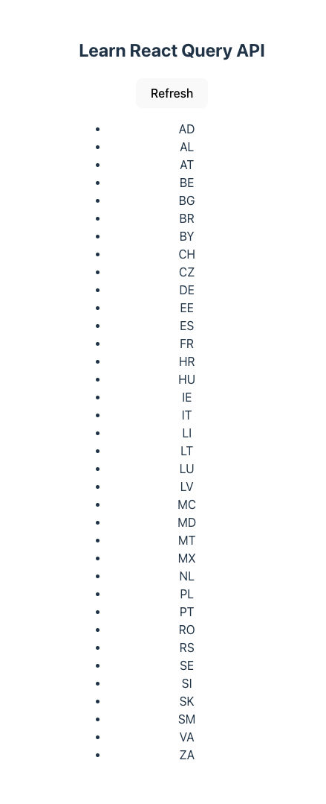

# Next:
- Compare with useEffect, and explain why
- Pagination

# What is React Query?

React Query helps you with:
- Fetching data (API calls)
- Caching that data
- Loading & error states
- Refetching when needed

# Example:

| Page when loaded | Page when loading | Page when error |
| ----- | ----- | ----- |
|  |  |  |

# Step 1: fetch function
You still need `fetch` to make API call

```ts
const fetchUsers = async () => {
  const response = await fetch('/api/users')
  if (!response.ok) {
    throw new Error('Network error')
  }
  return response.json()
}
```

# Step 2: useQuery() - Very important!
`useQuery()` handles the data and manage the lifecycle. It gives you back:
- `data`
- `isLoading`
- `error`

## `queryKey`
- `queryKey: ["users"]` is name of the data in the cache or identifier.
- If anyone asks for `users`, give them the cached version.
- It does not:
    - call the API
    - contain the URL

```ts
import { useQuery } from '@tanstack/react-query'

function Users() {
  const { data, isLoading, error } = useQuery({
    queryKey: ['users'],
    queryFn: fetchUsers,
  })

  if (isLoading) return <p>Loading...</p>
  if (error) return <p>Something went wrong</p>

  return (
    <ul>
      {data.map(user => (
        <li key={user.id}>{user.name}</li>
      ))}
    </ul>
  )
}

```

## The magic of React Query - Caching the data

Imagine this happens:

Component A
```ts
useQuery({ queryKey: ['users'], queryFn: fetchUsers })
```

Component B
```ts
useQuery({ queryKey: ['users'], queryFn: fetchUsers })
```

👉 Result:
- API is called once
- Both components share the same cached data

This is the “React Query magic” people talk about.

# Step 3: Refetching the data when data is stale

React Query will refetch your data automatically when:
- You switch tabs and come back
- The component remounts
- The network reconnects

Why? - Because server data might be out of date.

React Query thinks in two states:
- 🟢 Fresh → “Data is good, don’t refetch”
- 🟡 Stale → “Data might be old, refetch when possible”

**By default:**
- Data becomes stale immediately
- But it stays cached

**That means:**
- You see cached data instantly
- React Query may refetch in the background
This is why UIs feel fast.

## You can refetch the data manually
There is a `refetch` in `useQuery` function:
```ts
const { data, isLoading, refetch } = useQuery({
  queryKey: ['users'],
  queryFn: fetchUsers,
})
```

```ts
<button onClick={() => refetch()}>
  Refresh users
</button>

```

## You can control the `staleTime`

This means:
- For 5 minutes, React Query will trust the cache
- No background refetch

```ts
useQuery({
  queryKey: ['users'],
  queryFn: fetchUsers,
  staleTime: 5 * 60 * 1000, // 5 minutes
})
```

# QueryClient and QueryClientProvider
React Query needs a `QueryClient` (the cache manager), and you must wrap your app in a `QueryClientProvider`.

Create the client + provider (usually in `main.jsx` / `main.tsx`)
```ts
import React from 'react'
import ReactDOM from 'react-dom/client'
import { QueryClient, QueryClientProvider } from '@tanstack/react-query'
import App from './App'

const queryClient = new QueryClient()

ReactDOM.createRoot(document.getElementById('root')!).render(
  <React.StrictMode>
    <QueryClientProvider client={queryClient}>
      <App />
    </QueryClientProvider>
  </React.StrictMode>
)
```

